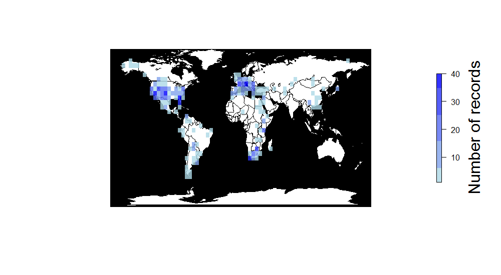
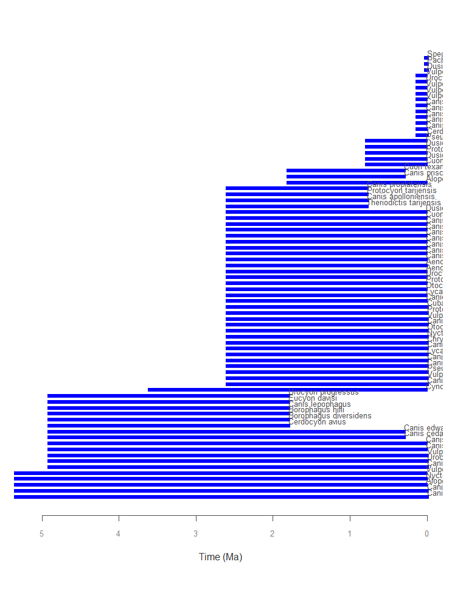
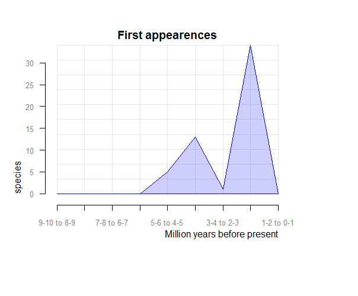

[](https://travis-ci.org/ropensci/paleobioDB)

paleobioDB
=======

### About

`paleobioDB` is a package for downloading, visualizing and processing data from [Paleobiology Database](http://paleobiodb.org/).


### Quick start

**Install**

Install paleobioDB from CRAN

```coffee
install.packages("paleobioDB")
library(paleobioDB)
```

Install paleobioDB developing version from github

```coffee
install.packages("devtools")
library(devtools)
install_github("ropensci/paleobioDB")
library(paleobioDB)
```

**General overview**

`paleobioDB` version 0.2 has 19 functions to wrap each endpoint of the PaleobioDB API, plus 8 functions to visualize and process the fossil data. The API documentation for the Paleobiology Database can be found [here](http://paleobiodb.org/data1.1/).

## Download fossil occurrences from the PaleobioDB

**pbdb_occurrences** 

e.g., to download all the fossil data that belongs to the family Canidae, set base_name = "Canidae".  

```coffee
> canidae<-  pbdb_occurrences (limit="all",
                             base_name="canidae", vocab="pbdb",
                             interval="Quaternary",             
                             show=c("coords", "phylo", "ident"))
head(canidae)
```

```coffee
## occurrence_no record_type collection_no            taxon_name taxon_rank taxon_no
## 150070  occurrence         13293              Cuon sp.      genus    41204
## 186572  occurrence         18320         Canis cf. sp.      genus    41198
## 186573  occurrence         18320            Vulpes sp.      genus    41248
## 186574  occurrence         18320        Borophagus sp.      genus    41196
## 192926  occurrence         19617        Canis edwardii    species    44838
## 192927  occurrence         19617 Canis armbrusteri cf.    species    44827
## matched_rank     early_interval    late_interval early_age late_age reference_no
## 5 Middle Pleistocene Late Pleistocene     0.781   0.0117         4412
## 5   Late Hemphillian          Blancan    10.300   1.8000         6086
## 5   Late Hemphillian          Blancan    10.300   1.8000         6086
## 5   Late Hemphillian          Blancan    10.300   1.8000         6086
## 3            Blancan     Irvingtonian     4.900   0.3000         2673
## 3            Blancan     Irvingtonian     4.900   0.3000         2673
## lng      lat  family family_no     order order_no    class class_no   phylum
## 111.56667 22.76667 Canidae     41189 Carnivora    36905 Mammalia    36651 Chordata
## -85.79195 40.45444 Canidae     41189 Carnivora    36905 Mammalia    36651 Chordata
## -85.79195 40.45444 Canidae     41189 Carnivora    36905 Mammalia    36651 Chordata
## -85.79195 40.45444 Canidae     41189 Carnivora    36905 Mammalia    36651 Chordata
## -112.40000 35.70000 Canidae     41189 Carnivora    36905 Mammalia    36651 Chordata
## -112.40000 35.70000 Canidae     41189 Carnivora    36905 Mammalia    36651 Chordata
## phylum_no genus_name species_name genus_reso reid_no species_reso matched_name
## 33815       Cuon          sp.       <NA>      NA         <NA>         <NA>
## 33815      Canis          sp.        cf.      NA         <NA>         <NA>
## 33815     Vulpes          sp.       <NA>      NA         <NA>         <NA>
## 33815 Borophagus          sp.       <NA>      NA         <NA>         <NA>
## 33815      Canis     edwardii       <NA>    8376         <NA>         <NA>
## 33815      Canis  armbrusteri       <NA>    8377          cf.         <NA>
## subgenus_name subgenus_reso
## <NA>          <NA>
## <NA>          <NA>
## <NA>          <NA>
## <NA>          <NA>
## <NA>          <NA>
## <NA>          <NA>
```

**CAUTION WITH THE RAW DATA**

Beware of synonyms and errors, they could twist your estimations about species richness, evolutionary and extinction rates, etc. paleobioDB users should be critical about the raw data downloaded from the database and filter the data before analyzing it.

For instance, when using "base_name" for downloading the information with the function pbdb_occurrences, check out the synonyms and errors that could appear in "taxon_name", "genus_name", etc. In our example, in canidae$genus_name there are errors: "Canidae" and "Caninae" appeared as genus names. If not eliminated, they will increase the richness of genera. 


## Map the fossil records

**pbdb_map**

Returns a map with the species occurrences.

```coffee
> pbdb_map(canidae)
``` 
 


**pbdb_map_occur**
Returns a map and a raster object with the sampling effort (number of fossil records per cell).

```coffee
> pbdb_map_occur (canidae, res= 5)
``` 
```coffee
## class       : RasterLayer 
## dimensions  : 34, 74, 2516  (nrow, ncol, ncell)
## resolution  : 5, 5  (x, y)
## extent      : -179.9572, 190.0428, -86.42609, 83.57391  (xmin, ## xmax, ymin, ymax)
## coord. ref. : NA 
## data source : in memory
## names       : layer 
## values      : 1, 40  (min, max)
``` 

 


**pbdb_map_richness**
Returns a map and a raster object with the number of different species, genera, family, etc. per cell. The user can change the resolution of the cells. 

```coffee
> pbdb_map_richness (canidae, res= 5, rank="species")
```
```coffee
## class       : RasterLayer 
## dimensions  : 34, 74, 2516  (nrow, ncol, ncell)
## resolution  : 5, 5  (x, y)
## extent      : -179.9572, 190.0428, -86.42609, 83.57391  (xmin, xmax, ymin, ymax)
## coord. ref. : NA 
## data source : in memory
## names       : layer 
## values      : 1, 12  (min, max)
```

 


## Explore your fossil data 


**pbdb_temporal_range**

Returns a dataframe and a plot with the time span of the species, genera, families, etc. in your query.

```coffee
> pbdb_temp_range (canidae, rank="species")
``` 
```coffee
                           max    min
## Canis brevirostris        5.3330 0.0000
## Canis mesomelas           5.3330 0.
## Alopex praeglacialis      5.3330 0.0117
## Nyctereutes megamastoides 5.3330 0.0117
## Vulpes atlantica          5.3330 0.0117
## Canis latrans             4.9000 0.0000
...

``` 
 


**pbdb_richness**

Returns a dataframe and a plot with the number of species (or genera, families, etc.) across time. You should set the temporal extent and the temporal resolution for the steps.

```coffee
> pbdb_richness (canidae, rank="species", temporal_extent=c(0,10), res=1)
```

```coffee
## labels2 richness
## <=1       23
## 1-2       56
## 2-3       53
## 3-4       19
## 4-5       18
## 5-6        5
## 6-7        0
## 7-8        0
## 8-9        0
## 9-10       0
## >10        0
``` 
 


**pbdb_orig_ext**

Returns a dataframe and a plot with the number of new appearances and last appearances of species, genera, families, etc. in your query across the time. You should set the temporal extent and the resolution of the steps. 

```coffee
# evolutionary rates= orig_ext=1
> pbdb_orig_ext (canidae, rank="species", orig_ext=1, temporal_extent=c(0,10), res=1)
```
```coffee
##              new ext
## 1-2 to 0-1    0  28
## 2-3 to 1-2   34   6
## 3-4 to 2-3    1   0
## 4-5 to 3-4   13   0
## 5-6 to 4-5    5   0
## 6-7 to 5-6    0   0
## 7-8 to 6-7    0   0
## 8-9 to 7-8    0   0
## 9-10 to 8-9   0   0
```




```coffee
# extinction rates= orig_ext=2
pbdb_orig_ext(canidae, rank="species", orig_ext=2, temporal_extent=c(0,10), res=1)
``` 
```coffee
##             new ext
## 1-2 to 0-1    0  28
## 2-3 to 1-2   34   6
## 3-4 to 2-3    1   0
## 4-5 to 3-4   13   0
## 5-6 to 4-5    5   0
## 6-7 to 5-6    0   0
## 7-8 to 6-7    0   0
## 8-9 to 7-8    0   0
## 9-10 to 8-9   0   0
``` 


**pbdb_subtaxa**

Returns a plot and a dataframe with the number of species, genera, families, etc. in your dataset.
  
```coffee
> pbdb_subtaxa (canidae, do.plot=TRUE)         
```
```coffee
## species genera families orders classes phyla
## 75     24        1      1       1     1
```
 


**pbdb_temporal_resolution**

Returns a plot and a dataframe with a main summary of the temporal resolution of the fossil records

```coffee
> pbdb_temporal_resolution (canidae)
```   

```coffee
## $summary
## Min. 1st Qu.  Median    Mean 3rd Qu.    Max. 
## 0.0117  0.1143  1.5000  1.5360  2.5760 23.0200 
## 
## $temporal_resolution
## [1]  0.7693  8.5000  8.5000  8.5000  4.6000
## [6]  4.6000  4.6000  3.1000  3.1000  3.1000
## [11]  3.1000  4.6000  3.1000  3.1000  3.1000
## [16]  3.1000  3.1000  3.1000  3.1000  3.1000
## [21]  3.1000  3.1000  3.1000  3.1000  3.1000
## [26]  3.1000  3.1000  3.1000  3.1000  3.1000
...
  
```
 

## Meta

Please report any [issues or bugs](https://github.com/ropensci/pbdb/issues).

License: GPL-2

To cite package `paleobioDB` in publications use:

```coffee
To cite package `paleobioDB` in publications use:

Sara Varela, Javier Gonzalez-Hernandez and Luciano Fabris Sgarbi (2014). paleobioDB: an R-package for downloading, visualizing and processing data from the Paleobiology Database. R package version 0.1. https://github.com/ropensci/paleobioDB

A BibTeX entry for LaTeX users is

  @Manual{,
    title = {paleobioDB: an R-package for downloading, visualizing and processing data from the Paleobiology Database},
    author = {{Sara Varela} and {Javier Gonzalez-Hernandez} and {Luciano Fabris Sgarbi}},
    year = {2014},
    note = {R package version 0.1},
    base = {https://github.com/ropensci/paleobioDB},
  }
```

---

This package is part of the [rOpenSci](http://ropensci.org/packages) project.

[](http://ropensci.org)
