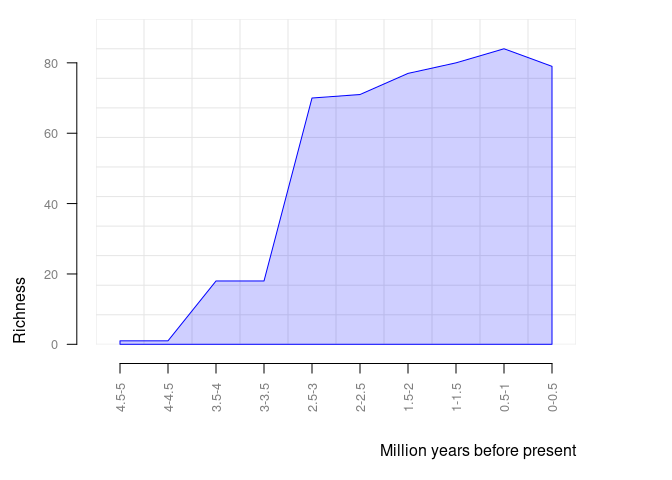

<!-- README.md is generated from README.Rmd. Please edit that file -->

# paleobioDB

<!-- badges: start -->

[](https://lifecycle.r-lib.org/articles/stages.html#experimental)
[](https://CRAN.R-project.org/package=paleobioDB)
[](https://github.com/metacran/cranlogs.app)
<!-- badges: end -->

`paleobioDB` is a package for downloading, visualizing and processing
data from the [Paleobiology Database](https://paleobiodb.org/).

## Installation

You can install the development version of paleobioDB from
[GitHub](https://github.com/) with:

``` r
# install.packages("devtools")
devtools::install_github("ropensci/paleobioDB")
```

## General overview

`paleobioDB` has 19 functions to wrap most endpoints of the PaleobioDB
API, plus 8 functions to visualize and process the fossil data. The API
documentation for the Paleobiology Database can be found
[here](https://paleobiodb.org/data1.2/).

## Download fossil occurrences from PaleobioDB

### `pbdb_occurrences`

Here is an example of how to download all fossil occurrences that belong
to the family Canidae in the Quaternary:

``` r
library(paleobioDB)

canidae <- pbdb_occurrences(
  base_name = "canidae",
  interval = "Quaternary",
  show = c("coords", "classext", "ident"),
  vocab = "pbdb",
  limit = "all"
)

dim(canidae)
#> [1] 1384   34

head(canidae, 3)
#>   occurrence_no record_type collection_no   identified_name identified_rank
#> 1        150070         occ         13293          Cuon sp.           genus
#> 2        192926         occ         19617    Canis edwardii         species
#> 3        192927         occ         19617 Canis armbrusteri         species
#>   identified_no     accepted_name accepted_rank accepted_no     early_interval
#> 1         41204              Cuon         genus       41204 Middle Pleistocene
#> 2         44838    Canis edwardii       species       44838       Irvingtonian
#> 3         44827 Canis armbrusteri       species       44827       Irvingtonian
#>      late_interval max_ma min_ma reference_no       lng      lat   phylum
#> 1 Late Pleistocene  0.781 0.0117         4412  111.5667 22.76667 Chordata
#> 2             <NA>  1.800 0.3000         2673 -112.4000 35.70000 Chordata
#> 3             <NA>  1.800 0.3000        52058 -112.4000 35.70000 Chordata
#>   phylum_no    class class_no     order order_no  family family_no genus
#> 1     33815 Mammalia    36651 Carnivora    36905 Canidae     41189  Cuon
#> 2     33815 Mammalia    36651 Carnivora    36905 Canidae     41189 Canis
#> 3     33815 Mammalia    36651 Carnivora    36905 Canidae     41189 Canis
#>   genus_no primary_name species_name reid_no species_reso difference
#> 1    41204         Cuon          sp.    <NA>         <NA>       <NA>
#> 2    41198        Canis     edwardii    8376         <NA>       <NA>
#> 3    41198        Canis  armbrusteri   30222         <NA>       <NA>
#>   primary_reso subgenus_name subgenus_reso
#> 1         <NA>          <NA>          <NA>
#> 2         <NA>          <NA>          <NA>
#> 3         <NA>          <NA>          <NA>
```

### Caution with the raw data

Beware of synonyms and errors, they could twist your estimations about
species richness, evolutionary and extinction rates, etc. `paleobioDB`
users should be critical about the raw data downloaded from the database
and filter the data before analyzing it.

For instance, when using `base_name` for downloading information with
the function `pbdb_occurrences()`, check out the synonyms and errors
that could appear in `accepted_name`, `genus`, etc. If they are not
corrected or eliminated, they will increase the richness of genera.

## Map the fossil records

### `pbdb_map`

Returns a map with the species occurrences.

``` r
pbdb_map(canidae)
```


### `pbdb_map_occur`

Returns a map and a raster object with the sampling effort (number of
fossil records per cell). The user can change the resolution of the
cells.

``` r
pbdb_map_occur(canidae, res = 5)
```


    #> class       : SpatRaster 
    #> dimensions  : 34, 74, 1  (nrow, ncol, nlyr)
    #> resolution  : 5, 5  (x, y)
    #> extent      : -180, 190, -85.19218, 84.80782  (xmin, xmax, ymin, ymax)
    #> coord. ref. : lon/lat WGS 84 
    #> source(s)   : memory
    #> name        : sum 
    #> min value   :   1 
    #> max value   :  67

### `pbdb_map_richness`

Returns a map and a raster object with the number of different species,
genera, family, etc. per cell. As with `pbdb_map_occur()`, the user can
change the resolution of the cells.

``` r
pbdb_map_richness(canidae, res = 5, rank = "species")
```


    #> class       : SpatRaster 
    #> dimensions  : 34, 74, 1  (nrow, ncol, nlyr)
    #> resolution  : 5, 5  (x, y)
    #> extent      : -180, 190, -85.19218, 84.80782  (xmin, xmax, ymin, ymax)
    #> coord. ref. : lon/lat WGS 84 
    #> source(s)   : memory
    #> name        : sum 
    #> min value   :   1 
    #> max value   :  14

## Explore your fossil data

### `pbdb_temporal_range`

Returns a dataframe and a plot with the time span of the species,
genera, families, etc. in your query.

``` r
tmp_range <- pbdb_temp_range(canidae, rank = "species")
```


``` r
head(tmp_range)
#>                     max    min
#> Canis lepophagus    4.9 0.0120
#> Canis gezi          4.0 0.7810
#> Lupulella mesomelas 3.6 0.0000
#> Vulpes chama        3.6 0.0000
#> Aenocyon dirus      3.6 0.0117
#> Canis hewitti       3.6 0.0117
```

### `pbdb_richness`

Returns a dataframe and a plot with the number of species (or genera,
families, etc.) across time. You should set the temporal extent and the
temporal resolution for the steps.

``` r
pbdb_richness(canidae, rank = "species", temporal_extent = c(0, 10), res = 1)
```



    #>    temporal_intervals richness
    #> 1                 0-1       93
    #> 2                 1-2       83
    #> 3                 2-3       71
    #> 4                 3-4       18
    #> 5                 4-5        1
    #> 6                 5-6        0
    #> 7                 6-7        0
    #> 8                 7-8        0
    #> 9                 8-9        0
    #> 10               9-10        0

### `pbdb_orig_ext`

Returns a dataframe and a plot with the number of new appearances and
last appearances of species, genera, families, etc. in your query across
the time. You should set the temporal extent and the resolution of the
steps. `orig_ext = 1` plots new appearances, `orig_ext = 2` plots last
appearances in the provided data (possibly extinctions, if the data are
complete enough).

``` r
pbdb_orig_ext(
  canidae,
  rank = "species",
  orig_ext = 1, temporal_extent = c(0, 10), res = 1
)
```


    #>             new ext
    #> 1-2 to 0-1    7   5
    #> 2-3 to 1-2   12   0
    #> 3-4 to 2-3   53   0
    #> 4-5 to 3-4   16   0
    #> 5-6 to 4-5    2   0
    #> 6-7 to 5-6    0   0
    #> 7-8 to 6-7    0   0
    #> 8-9 to 7-8    0   0
    #> 9-10 to 8-9   0   0

``` r
pbdb_orig_ext(
  canidae,
  rank = "species",
  orig_ext = 2, temporal_extent = c(0, 10), res = 1
)
```


    #>             new ext
    #> 1-2 to 0-1    7   5
    #> 2-3 to 1-2   12   0
    #> 3-4 to 2-3   53   0
    #> 4-5 to 3-4   16   0
    #> 5-6 to 4-5    2   0
    #> 6-7 to 5-6    0   0
    #> 7-8 to 6-7    0   0
    #> 8-9 to 7-8    0   0
    #> 9-10 to 8-9   0   0

## `pbdb_subtaxa`

Returns a plot and a dataframe with the number of species, genera,
families, etc. in your dataset.

``` r
pbdb_subtaxa(canidae, do.plot = TRUE)
```


    #>   species genera families orders classes phyla
    #> 1      98     27        1      1       1     1

## `pbdb_temporal_resolution`

Returns a plot and a dataframe with a main summary of the temporal
resolution of the fossil records.

<!-- TODO: truncate output -->

``` r
pbdb_temporal_resolution(canidae)
```


## Docker \[TODO\]

We are including a Dockerfile to ease working on the package as it
fulfills all the system dependencies of the package.

How to load the package with Docker:

1.  Install Docker. Reference here:
    <https://docs.docker.com/get-started>

2.  Build the *docker image*: from the root folder of this repository.
    Type:

``` bash
docker build -t rpbdb Docker
```

This command will create a *docker image* in your system based on some
of the [rocker/tidyverse](https://hub.docker.com/r/rocker/tidyverse/)
images. You can see the new image with `docker image ls`.

3.  Start a container for this image. Type the following command picking
    some *<password>* of your choice.

``` bash
docker run -d --rm -p 8787:8787 -e PASSWORD=<password> -v $PWD:/home/rstudio rpbdb
```

This will start a container with access to your current folder where all
the code of the package is. Inside the container, the code will be
located in */home/rstudio*. It also exposes the port 8787 of the
container so you may access to the RStudio web application which is
bundled in the *rocker* base image.

4.  Navigate to <http://localhost:8787>. Enter with user=*rstudio* and
    the password you used in the command above.

5.  You may enter to the container via console with:

``` bash
docker exec -ti ravis bash
```

Either from RStudio or from within the container you can install the
package out of the code with:

``` bash
cd /home/rstudio
R
```

``` r
library(devtools)
install.packages(".", repos = NULL, type = "source")
```

## Meta \[TODO\]

Please report any [issues or
bugs](https://github.com/ropensci/pbdb/issues).

License: GPL-2

To cite package `paleobioDB` in publications use:

    #> Warning in citation("paleobioDB"): could not determine year for 'paleobioDB'
    #> from package DESCRIPTION file
    #> To cite package 'paleobioDB' in publications use:
    #> 
    #>   Varela S, González Hernández J, Fabris Sgarbi L (????). _paleobioDB:
    #>   Download and Process Data from the Paleobiology Database_. R package
    #>   version 0.7.0.9000, https://github.com/ropensci/paleobioDB,
    #>   <https://docs.ropensci.org/paleobioDB>.
    #> 
    #> A BibTeX entry for LaTeX users is
    #> 
    #>   @Manual{,
    #>     title = {paleobioDB: Download and Process Data from the Paleobiology Database},
    #>     author = {Sara Varela and Javier {González Hernández} and Luciano {Fabris Sgarbi}},
    #>     note = {R package version 0.7.0.9000, 
    #> https://github.com/ropensci/paleobioDB},
    #>     url = {https://docs.ropensci.org/paleobioDB},
    #>   }

------------------------------------------------------------------------

This package is part of the [rOpenSci](http://ropensci.org/packages)
project.

[](http://ropensci.org)
