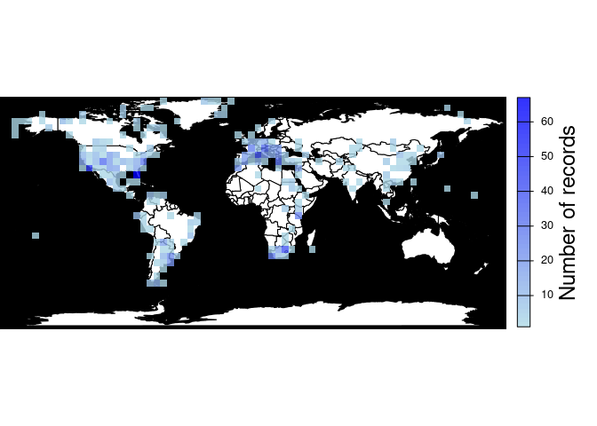

<!-- README.md is generated from README.Rmd. Please edit that file -->

# paleobioDB

<!-- badges: start -->

[](https://lifecycle.r-lib.org/articles/stages.html#experimental)
[](https://CRAN.R-project.org/package=paleobioDB)
[](https://github.com/r-hub/cranlogs.app)
<!-- badges: end -->

`paleobioDB` is a package for downloading, visualizing and processing
data from the [Paleobiology Database](https://paleobiodb.org/).

## Installation

You can install the development version of paleobioDB from
[GitHub](https://github.com/) with:

``` r
# install.packages("devtools")
devtools::install_github("ropensci/paleobioDB")
```

## General overview

`paleobioDB` has 19 functions to wrap most endpoints of the PaleobioDB
API, plus 8 functions to visualize and process the fossil data. The API
documentation for the Paleobiology Database can be found
[here](https://paleobiodb.org/data1.2/).

## Download fossil occurrences from PaleobioDB

### `pbdb_occurrences`

Here is an example of how to download all fossil occurrences that belong
to the family Canidae in the Quaternary:

``` r
library(paleobioDB)

canidae <- pbdb_occurrences(
  base_name = "canidae",
  interval = "Quaternary",
  show = c("coords", "class"),
  vocab = "pbdb",
  limit = "all"
)

dim(canidae)
#> [1] 1384   23

head(canidae, 3)
#>   occurrence_no record_type collection_no   identified_name identified_rank
#> 1        150070         occ         13293          Cuon sp.           genus
#> 2        192926         occ         19617    Canis edwardii         species
#> 3        192927         occ         19617 Canis armbrusteri         species
#>   identified_no     accepted_name accepted_rank accepted_no     early_interval
#> 1         41204              Cuon         genus       41204 Middle Pleistocene
#> 2         44838    Canis edwardii       species       44838       Irvingtonian
#> 3         44827 Canis armbrusteri       species       44827       Irvingtonian
#>      late_interval max_ma min_ma reference_no       lng      lat   phylum
#> 1 Late Pleistocene  0.781 0.0117         4412  111.5667 22.76667 Chordata
#> 2             <NA>  1.800 0.3000         2673 -112.4000 35.70000 Chordata
#> 3             <NA>  1.800 0.3000        52058 -112.4000 35.70000 Chordata
#>      class     order  family genus reid_no difference
#> 1 Mammalia Carnivora Canidae  Cuon    <NA>       <NA>
#> 2 Mammalia Carnivora Canidae Canis    8376       <NA>
#> 3 Mammalia Carnivora Canidae Canis   30222       <NA>
```

Note that if the plotting and analysis functions of this package are
going to be used (as demonstrated in the sections below), it is
necessary to specify the parameter `show = c("coords", "class")` in the
`pbdb_occurrences()` function. This returns taxonomic and geographic
information for the occurrences that is required by these functions.

### Caution with the raw data

Beware of synonyms and errors, they could twist your estimations about
species richness, evolutionary and extinction rates, etc. `paleobioDB`
users should be critical about the raw data downloaded from the database
and filter the data before analyzing it.

For instance, when using `base_name` for downloading information with
the function `pbdb_occurrences()`, check out the synonyms and errors
that could appear in `accepted_name`, `genus`, etc. If they are not
corrected or eliminated, they will increase the richness of genera.

## Map the fossil records

### `pbdb_map`

Plots a map showing fossil occurrences.

``` r
pbdb_map(canidae)
```

<!-- -->

### `pbdb_map_occur`

Returns a map and a raster object with the sampling effort (number of
fossil records per cell). The user can change the resolution of the
cells.

``` r
pbdb_map_occur(canidae, res = 5)
```

<!-- -->

    #> class       : SpatRaster 
    #> dimensions  : 34, 74, 1  (nrow, ncol, nlyr)
    #> resolution  : 5, 5  (x, y)
    #> extent      : -180, 190, -85.19218, 84.80782  (xmin, xmax, ymin, ymax)
    #> coord. ref. : lon/lat WGS 84 
    #> source(s)   : memory
    #> name        : sum 
    #> min value   :   1 
    #> max value   :  67

### `pbdb_map_richness`

Returns a map and a raster object with the number of different species,
genera, family, etc. per cell. As with `pbdb_map_occur()`, the user can
change the resolution of the cells.

``` r
pbdb_map_richness(canidae, res = 5, rank = "species")
```

<!-- -->

    #> class       : SpatRaster 
    #> dimensions  : 34, 74, 1  (nrow, ncol, nlyr)
    #> resolution  : 5, 5  (x, y)
    #> extent      : -180, 190, -85.19218, 84.80782  (xmin, xmax, ymin, ymax)
    #> coord. ref. : lon/lat WGS 84 
    #> source(s)   : memory
    #> name        : sum 
    #> min value   :   1 
    #> max value   :  14

## Explore your fossil data

### `pbdb_temp_range`

Returns a data frame and a plot with the time span of the species,
genera, families, etc. in your query. Make sure that enough vertical
space is provided in the graphics device used to do the plotting if
there are many taxa of the specified rank in your data set.

``` r
pbdb_temp_range(canidae, rank = "species")
```

<!-- -->

    #>                             max    min
    #> Canis lepophagus          4.900 0.0120
    #> Canis gezi                4.000 0.7810
    #> Canis chihliensis         3.600 0.7810
    #> Canis palmidens           3.600 0.7810
    #> Eucyon minor              3.600 0.7810
    ....
    #> Urocyon littoralis        0.300 0.0000
    #> Pseudalopex sechurae      0.126 0.0117
    #> Vulpes macrotis           0.126 0.0117
    #> Cubacyon transversidens   0.126 0.0000
    #> Lycalopex griseus         0.126 0.0000
    #> Speothos pacivorus        0.126 0.0000

### `pbdb_richness`

Returns a data frame and a plot with the number of species (or genera,
families, etc.) across time. You should set the temporal extent and the
temporal resolution for the steps.

``` r
pbdb_richness(canidae, rank = "species", temporal_extent = c(0, 5), res = 0.5)
```

<!-- -->

    #>    temporal_intervals richness
    #> 1               0-0.5       74
    #> 2               0.5-1       87
    #> 3               1-1.5       78
    #> 4               1.5-2       81
    #> 5               2-2.5       71
    #> 6               2.5-3       71
    #> 7               3-3.5       18
    #> 8               3.5-4       15
    #> 9               4-4.5        1
    #> 10              4.5-5        1

### `pbdb_orig_ext`

Returns a data frame and a plot with the number of new appearances and
last appearances of species, genera, families, etc. in your query across
time. You should set the temporal extent and the resolution of the
steps. `orig_ext = 1` plots new appearances:

``` r
pbdb_orig_ext(
  canidae,
  rank = "species",
  orig_ext = 1, temporal_extent = c(0, 5), res = 0.5
)
```

<!-- -->

    #>                new ext
    #> 0.5-1 to 0-0.5   4  19
    #> 1-1.5 to 0.5-1   9   0
    #> 1.5-2 to 1-1.5   2   5
    #> 2-2.5 to 1.5-2  10   0
    #> 2.5-3 to 2-2.5   0   0
    #> 3-3.5 to 2.5-3  53   0
    #> 3.5-4 to 3-3.5   3   0
    #> 4-4.5 to 3.5-4  13   0
    #> 4.5-5 to 4-4.5   1   0

And `orig_ext = 2` plots last appearances in the provided data frame
(possibly extinctions, if the data are complete enough).

``` r
pbdb_orig_ext(
  canidae,
  rank = "species",
  orig_ext = 2, temporal_extent = c(0, 5), res = 0.5
)
```

<!-- -->

    #>                new ext
    #> 0.5-1 to 0-0.5   4  19
    #> 1-1.5 to 0.5-1   9   0
    #> 1.5-2 to 1-1.5   2   5
    #> 2-2.5 to 1.5-2  10   0
    #> 2.5-3 to 2-2.5   0   0
    #> 3-3.5 to 2.5-3  53   0
    #> 3.5-4 to 3-3.5   3   0
    #> 4-4.5 to 3.5-4  13   0
    #> 4.5-5 to 4-4.5   1   0

### `pbdb_subtaxa`

Returns a plot and a data frame with the number of species, genera,
families, etc. in your dataset.

``` r
pbdb_subtaxa(canidae, do.plot = TRUE)
```

<!-- -->

    #>   species genera families orders classes phyla
    #> 1      98     27        1      1       1     1

### `pbdb_temporal_resolution`

Returns a plot and a list with a summary of the temporal resolution of
the fossil records.

``` r
pbdb_temporal_resolution(canidae)
```

<!-- -->

    #> $summary
    #>    Min. 1st Qu.  Median    Mean 3rd Qu.    Max. 
    #>  0.0117  0.1143  0.6550  0.9617  1.8070  4.8880 
    #> 
    #> $temporal_resolution
    #>    [1] 0.7693 1.5000 1.5000 1.5000 0.7820 0.7820 0.7820 0.7820 1.5000 1.5000
    ....
    #> [1331] 1.8070 1.8070 1.8070 1.8070 1.8070 2.8190 2.8190 2.8190 2.8190 2.8190
    #> [1341] 0.1260 2.5763 1.8070 0.4190 0.4190 0.4190 0.4190 0.4190 3.2190 0.7690
    #> [1351] 0.0117 0.0117 0.0117 2.5880 2.5763 2.5763 0.7690 0.7690 0.7690 0.1143
    #> [1361] 0.4190 0.1143 0.7690 2.5763 0.1143 0.7690 0.1143 2.5763 0.7690 0.6550
    #> [1371] 0.6550 1.8070 2.8190 1.5000 2.5763 2.5763 2.5763 0.1143 2.5763 2.5763
    #> [1381] 2.5763 2.5763 0.0117 0.0117

## Docker

We include a Dockerfile to ease working on the package as it fulfills
all its system dependencies.

How to load the package with Docker:

1.  Install Docker. Reference here:
    <https://docs.docker.com/get-started/>

2.  Build the docker image. From the root folder of this repository,
    type:

``` bash
docker build -t rpbdb Docker
```

This command will create a docker image in your system based on some of
the [rocker/tidyverse](https://hub.docker.com/r/rocker/tidyverse/)
images. You can see the new image with `docker image ls`.

3.  Start a container for this image. Type the following command picking
    some `<password>` of your choice.

``` bash
docker run -d --name="rpbdb_rstudio" --rm -p 8787:8787 \
       -e PASSWORD=<password> -v $PWD:/home/rstudio rpbdb
```

This will start a container with access to your current folder where all
the code of the package is. Inside the container, the code will be
located in `/home/rstudio`. It also exposes the port 8787 of the
container so you may access the RStudio web application which is bundled
in the Rocker base image.

4.  Then, you can either:

    -   Navigate to `http://localhost:8787`. Enter with username
        “rstudio” and the password you used in the command above.

    -   Or you can enter the container via console with:

    ``` bash
    docker exec -ti -u rstudio -w /home/rstudio rpbdb_rstudio R
    ```

Either from RStudio or from within the container you can install the
package from source with:

``` r
install.packages(".", repos = NULL, type = "source")
```

5.  When you are finished, you can stop the container:

``` bash
docker container stop rpbdb_rstudio
```

## Meta

Please report any [issues or
bugs](https://github.com/ropensci/paleobioDB/issues).

License: GPL-2

    #> To cite package 'paleobioDB' in publications use:
    #> 
    #>   Varela S, González-Hernández J, Sgarbi LF, Marshall C, Uhen MD,
    #>   Peters S, McClennen M (2015). "paleobioDB: an R package for
    #>   downloading, visualizing and processing data from the Paleobiology
    #>   Database." _Ecography_, *38*(4), 419-425. doi:10.1111/ecog.01154
    #>   <https://doi.org/10.1111/ecog.01154>.
    #> 
    #> A BibTeX entry for LaTeX users is
    #> 
    #>   @Article{,
    #>     title = {paleobioDB: an R package for downloading, visualizing and processing data from the Paleobiology Database.},
    #>     author = {Sara Varela and Javier González-Hernández and Luciano F. Sgarbi and Charles Marshall and Mark D. Uhen and Shanan Peters and Michael McClennen},
    #>     journal = {Ecography},
    #>     year = {2015},
    #>     volume = {38},
    #>     number = {4},
    #>     pages = {419-425},
    #>     doi = {10.1111/ecog.01154},
    #>   }

------------------------------------------------------------------------

This package is part of the [rOpenSci](https://ropensci.org/packages)
project.

[](https://ropensci.org)
