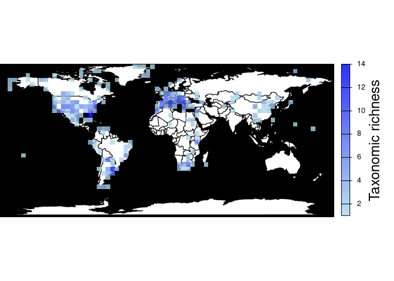
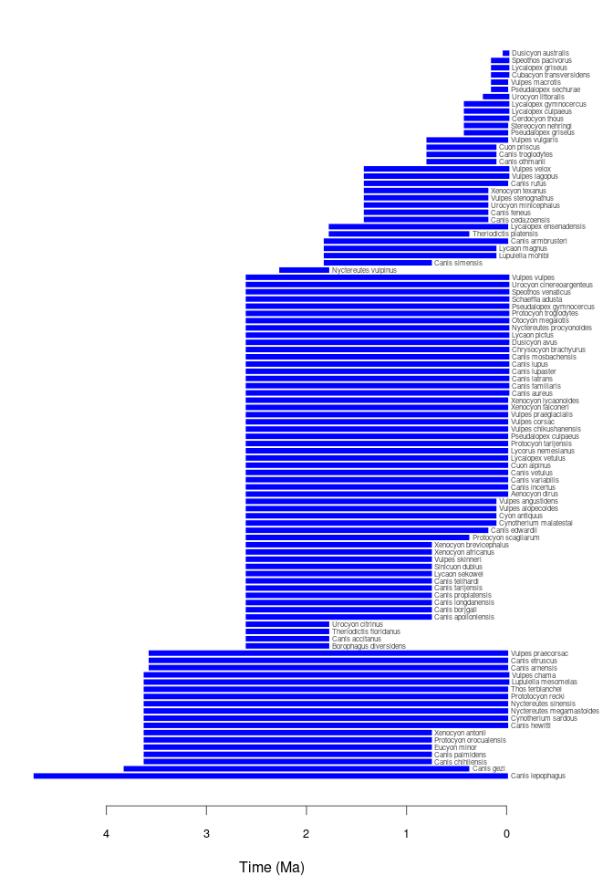
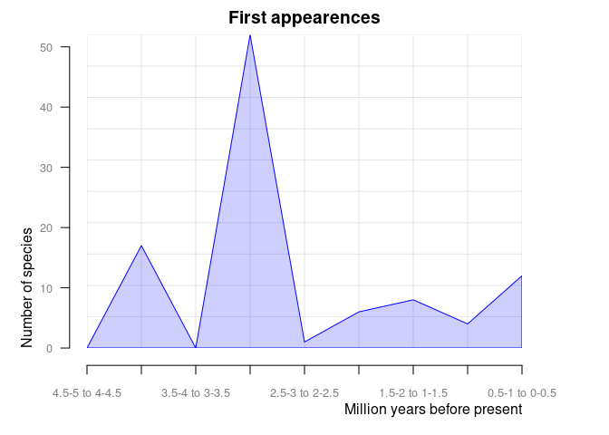

<!-- README.md is generated from README.Rmd. Please edit that file -->

# paleobioDB

<!-- badges: start -->

[](https://CRAN.R-project.org/package=paleobioDB)
[](https://github.com/r-hub/cranlogs.app)
[](https://github.com/ropensci/paleobioDB/actions/workflows/R-CMD-check.yaml)
<!-- badges: end -->

`paleobioDB` is a package for downloading, visualizing and processing
data from the [Paleobiology Database](https://paleobiodb.org/).

## Installation

Install the latest release from CRAN:

``` r
install.packages("paleobioDB")
```

Alternatively, you can install the development version of paleobioDB
from [GitHub](https://github.com/) with:

``` r
# install.packages("devtools")
devtools::install_github("ropensci/paleobioDB")
```

## General overview

`paleobioDB` provides functions that wrap most endpoints of the
PaleobioDB API, and allows visualizing and processing the fossil data.
The API documentation for the Paleobiology Database can be found
[here](https://paleobiodb.org/data1.2/).

## Download fossil occurrences from PaleobioDB

### `pbdb_occurrences`

Here is an example of how to download all fossil occurrences that belong
to the family Canidae in the Quaternary:

``` r
library(paleobioDB)

canidae <- pbdb_occurrences(
  base_name = "canidae",
  interval = "Quaternary",
  show = c("coords", "classext"),
  vocab = "pbdb",
  limit = "all"
)

dim(canidae)
#> [1] 1395   28

head(canidae, 3)
#>   occurrence_no record_type collection_no   identified_name identified_rank
#> 1        150070         occ         13293          Cuon sp.           genus
#> 2        192926         occ         19617    Canis edwardii         species
#> 3        192927         occ         19617 Canis armbrusteri         species
#>   identified_no     accepted_name accepted_rank accepted_no     early_interval
#> 1         41204              Cuon         genus       41204 Middle Pleistocene
#> 2         44838    Canis edwardii       species       44838       Irvingtonian
#> 3         44827 Canis armbrusteri       species       44827       Irvingtonian
#>      late_interval max_ma min_ma reference_no       lng      lat   phylum
#> 1 Late Pleistocene  0.774 0.0117         4412  111.5667 22.76667 Chordata
#> 2             <NA>  1.400 0.2100         2673 -112.4000 35.70000 Chordata
#> 3             <NA>  1.400 0.2100        52058 -112.4000 35.70000 Chordata
#>   phylum_no    class class_no     order order_no  family family_no genus
#> 1     33815 Mammalia    36651 Carnivora    36905 Canidae     41189  Cuon
#> 2     33815 Mammalia    36651 Carnivora    36905 Canidae     41189 Canis
#> 3     33815 Mammalia    36651 Carnivora    36905 Canidae     41189 Canis
#>   genus_no reid_no difference
#> 1    41204    <NA>       <NA>
#> 2    41198    8376       <NA>
#> 3    41198   30222       <NA>
```

Note that if the plotting and analysis functions of this package are
going to be used (as demonstrated in the sections below), it is
necessary to specify the parameter `show = c("coords", "classext")` in
the `pbdb_occurrences()` function. This returns taxonomic and geographic
information for the occurrences that is required by these functions.

### Caution with raw data

Beware of synonyms and errors, they could twist your estimations about
species richness, evolutionary and extinction rates, etc. `paleobioDB`
users should be critical about the raw data downloaded from the database
and filter the data before analyzing it.

For instance, when using `base_name` for downloading information with
the function `pbdb_occurrences()`, check out the synonyms and errors
that could appear in `accepted_name`, `genus`, etc. If they are not
corrected or eliminated, they will increase the richness of genera.

## Map the fossil records

### `pbdb_map`

Plots a map showing fossil occurrences and invisibly returns a data
frame with the number of occurrences per coordinate.

``` r
(pbdb_map(canidae))
```

<!-- -->

    #>                               lng        lat Occur
    #> -70.583885.-52.415833  -70.583885 -52.415833     1
    #> -69.583336.-52.166668  -69.583336 -52.166668     1
    #> -70.060555.-52.054722  -70.060555 -52.054722     1
    #> -60.46299.-51.829769   -60.462990 -51.829769     1
    #> -70.174446.-51.74778   -70.174446 -51.747780     1
    ....
    #> 22.033333.46.966667     22.033333  46.966667    11
    #> 11.25.45.416668         11.250000  45.416668    12
    #> -117.33.900002        -117.000000  33.900002    13
    #> 5.395.43.686111          5.395000  43.686111    14
    #> -105.699997.39.299999 -105.699997  39.299999    15
    #> 27.7208.-26.016701      27.720800 -26.016701    18

### `pbdb_map_occur`

Returns a map and a raster object with the sampling effort (number of
fossil records per cell). The user can change the resolution of the
cells.

``` r
pbdb_map_occur(canidae, res = 5)
```

<!-- -->

    #> class       : SpatRaster 
    #> dimensions  : 34, 74, 1  (nrow, ncol, nlyr)
    #> resolution  : 5, 5  (x, y)
    #> extent      : -180, 190, -85.19218, 84.80782  (xmin, xmax, ymin, ymax)
    #> coord. ref. : lon/lat WGS 84 
    #> source(s)   : memory
    #> name        : sum 
    #> min value   :   1 
    #> max value   :  67

### `pbdb_map_richness`

Returns a map and a raster object with the number of different species,
genera, family, etc. per cell. As with `pbdb_map_occur()`, the user can
change the resolution of the cells.

``` r
pbdb_map_richness(canidae, res = 5, rank = "species")
```

<!-- -->

    #> class       : SpatRaster 
    #> dimensions  : 34, 74, 1  (nrow, ncol, nlyr)
    #> resolution  : 5, 5  (x, y)
    #> extent      : -180, 190, -85.19218, 84.80782  (xmin, xmax, ymin, ymax)
    #> coord. ref. : lon/lat WGS 84 
    #> source(s)   : memory
    #> name        : sum 
    #> min value   :   1 
    #> max value   :  14

If you do not need the plot and you are only interested in obtaining a
richness raster for some other purposes, you could use the argument
`do_plot = FALSE`. For instance, this returns the same raster object as
above (a `SpatRaster` object from the `terra` package) without plotting
it:

``` r
pbdb_map_richness(canidae, res = 5, rank = "species", do_plot = FALSE)
#> class       : SpatRaster 
#> dimensions  : 34, 74, 1  (nrow, ncol, nlyr)
#> resolution  : 5, 5  (x, y)
#> extent      : -180, 190, -85.19218, 84.80782  (xmin, xmax, ymin, ymax)
#> coord. ref. : lon/lat WGS 84 
#> source(s)   : memory
#> name        : sum 
#> min value   :   1 
#> max value   :  14
```

The `do_plot` argument is available in all the functions in the package
that produce a plot and return an object. This means that the plot is
optional in all the other plotting functions that are described here.
Check their documentation for more details.

## Explore your fossil data

### `pbdb_temp_range`

Returns a data frame and a plot with the time span of the species,
genera, families, etc. in your query. Make sure that enough vertical
space is provided in the graphics device used to do the plotting if
there are many taxa of the specified rank in your data set.

``` r
pbdb_temp_range(canidae, rank = "species")
```

<!-- -->

    #>                              max    min
    #> Canis lepophagus          4.7000 0.0140
    #> Canis gezi                3.7000 0.3000
    #> Canis chihliensis         3.6000 0.7740
    #> Canis palmidens           3.6000 0.7740
    #> Eucyon minor              3.6000 0.7740
    ....
    #> Pseudalopex sechurae      0.1290 0.0117
    #> Vulpes macrotis           0.1290 0.0117
    #> Cubacyon transversidens   0.1290 0.0000
    #> Lycalopex griseus         0.1290 0.0000
    #> Speothos pacivorus        0.1290 0.0000
    #> Dusicyon australis        0.0117 0.0000

### `pbdb_richness`

Returns a data frame and a plot with the number of species (or genera,
families, etc.) across time. You should set the temporal extent and the
temporal resolution for the steps.

``` r
pbdb_richness(canidae, rank = "species", temporal_extent = c(0, 5), res = 0.5)
```

<!-- -->

    #>    temporal_intervals richness
    #> 1               0-0.5       78
    #> 2               0.5-1       83
    #> 3               1-1.5       79
    #> 4               1.5-2       77
    #> 5               2-2.5       71
    #> 6               2.5-3       71
    #> 7               3-3.5       18
    #> 8               3.5-4       15
    #> 9               4-4.5        1
    #> 10              4.5-5        1

### `pbdb_orig_ext`

Returns a data frame and a plot with the number of appearances and
dissapearances of taxa between consecutive time intervals in the data
you provide. These time intervals are defined by the temporal extent
(`temporal_extent`) and resolution (`res`) arguments. This is another
way of visualizing the same information that is shown in the
`pbdb_temp_range()` plot. `orig_ext = 1` plots new appearances:

``` r
pbdb_orig_ext(
  canidae,
  rank = "species",
  orig_ext = 1, temporal_extent = c(0, 5), res = 0.5
)
```

<!-- -->

    #>                new ext
    #> 0.5-1 to 0-0.5  12  17
    #> 1-1.5 to 0.5-1   4   0
    #> 1.5-2 to 1-1.5   7   5
    #> 2-2.5 to 1.5-2   6   0
    #> 2.5-3 to 2-2.5   0   0
    #> 3-3.5 to 2.5-3  53   0
    #> 3.5-4 to 3-3.5   3   0
    #> 4-4.5 to 3.5-4  14   0
    #> 4.5-5 to 4-4.5   0   0

And `orig_ext = 2` plots disappearances of taxa between time intervals
in the provided data frame.

``` r
pbdb_orig_ext(
  canidae,
  rank = "species",
  orig_ext = 2, temporal_extent = c(0, 5), res = 0.5
)
```

<!-- -->

    #>                new ext
    #> 0.5-1 to 0-0.5  12  17
    #> 1-1.5 to 0.5-1   4   0
    #> 1.5-2 to 1-1.5   7   5
    #> 2-2.5 to 1.5-2   6   0
    #> 2.5-3 to 2-2.5   0   0
    #> 3-3.5 to 2.5-3  53   0
    #> 3.5-4 to 3-3.5   3   0
    #> 4-4.5 to 3.5-4  14   0
    #> 4.5-5 to 4-4.5   0   0

### `pbdb_subtaxa`

Returns a plot and a data frame with the number of species, genera,
families, etc. in your dataset.

``` r
pbdb_subtaxa(canidae)
```

<!-- -->

    #>   species genera families orders classes phyla
    #> 1     100     27        1      1       1     1

### `pbdb_temporal_resolution`

Returns a plot and a list with a summary of the temporal resolution of
the fossil records.

``` r
pbdb_temporal_resolution(canidae)
```

<!-- -->

    #> $summary
    #>    Min. 1st Qu.  Median    Mean 3rd Qu.    Max. 
    #>  0.0117  0.1173  0.6450  0.9294  1.8060  4.6860 
    #> 
    #> $temporal_resolution
    #>    [1] 0.7623 1.1900 1.1900 1.1900 4.4900 0.7800 0.7800 0.7800 0.7800 4.4900
    ....
    #> [1341] 2.8260 2.8260 2.8260 0.1290 2.5683 1.8060 1.4000 1.4000 1.4000 1.4000
    #> [1351] 1.4000 3.4000 0.2883 0.0117 0.0117 0.0117 2.5800 2.5683 2.5683 0.2883
    #> [1361] 0.2883 0.2883 0.1173 1.4000 0.1173 0.2883 2.5683 0.1173 0.2883 0.1173
    #> [1371] 2.5683 0.2883 0.6450 0.6450 1.8060 2.8260 1.1900 2.5683 2.5683 2.5683
    #> [1381] 0.1173 2.5683 2.5683 2.5683 2.5683 0.0117 0.0117 1.0260 0.6450 0.0117
    #> [1391] 0.0117 0.7623 0.6450 0.6450 0.6450

## Meta

Please report any [issues or
bugs](https://github.com/ropensci/paleobioDB/issues).

License: GPL-2

    #> To cite package 'paleobioDB' in publications use:
    #> 
    #>   Varela S, González-Hernández J, Sgarbi LF, Marshall C, Uhen MD,
    #>   Peters S, McClennen M (2015). "paleobioDB: an R package for
    #>   downloading, visualizing and processing data from the Paleobiology
    #>   Database." _Ecography_, *38*(4), 419-425. doi:10.1111/ecog.01154
    #>   <https://doi.org/10.1111/ecog.01154>.
    #> 
    #> A BibTeX entry for LaTeX users is
    #> 
    #>   @Article{,
    #>     title = {paleobioDB: an R package for downloading, visualizing and processing data from the Paleobiology Database.},
    #>     author = {Sara Varela and Javier González-Hernández and Luciano F. Sgarbi and Charles Marshall and Mark D. Uhen and Shanan Peters and Michael McClennen},
    #>     journal = {Ecography},
    #>     year = {2015},
    #>     volume = {38},
    #>     number = {4},
    #>     pages = {419-425},
    #>     doi = {10.1111/ecog.01154},
    #>   }

------------------------------------------------------------------------

This package is part of the [rOpenSci](https://ropensci.org/packages)
project.

[](https://ropensci.org)
